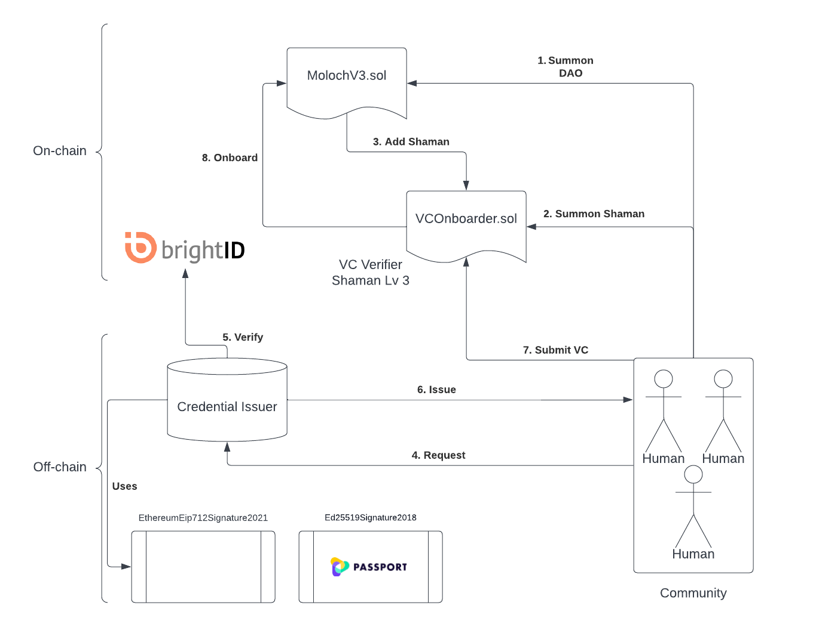

# VCOnboarder Monorepo

## DAOHAus VCOnboarder - MolochV3 + BrightID + Verifiable Credentials

VCOnboarder is a dApp and MolochV3 Shaman contract that allows you to onboard new members to your DAO through a sibling-resistant layer using verifiable credentials with on-chain verification based on [EIP-712 standard](https://eips.ethereum.org/EIPS/eip-712) for typed structured data hashing and signing [scheme](https://w3c-ccg.github.io/ethereum-eip712-signature-2021-spec/).

## Architecture



## Demo

- [Video](https://youtu.be/r-Lx0txy6L8)

- [App](https://amused-rabbit.surge.sh/)

- [VC Issuer Server](https://safe-springs-93379.herokuapp.com)

## Local Deployment

This repository contains both onboarding frontend and a sample verifiable credentials issuer server. Smart contract code can be found in the DAOHaus Shamans [repo](https://github.com/HausDAO/baal-shamans/tree/feat/vc-onboarder)

If you want to deploy it locally, follow the instructions listed below:

1. Install dependencies

```
yarn install
```

2. Deploy VC issuer server

```
yarn serve:dev
```

3. Create a `.env` file under `packages/frontend` and specify the following variables:

```
VITE_VC_ISSUER_SERVER=
```

4. Start the frontend app

```
yarn app:dev
```

## Deployed Contracts

| Network | DIDStampVCVerifier.sol | VCOnboarderShamanSummoner.sol |
| ------- | ---------------------- | ----------------------------- |
| Goerli | [0x734812ecbF27cd8eb52ED089af37513eee593847](https://goerli.etherscan.io/address/0x734812ecbF27cd8eb52ED089af37513eee593847) | [0xd6A54B8Ad07EF14B91fc85940C7A284A589BbBcd](https://goerli.etherscan.io/address/0xd6A54B8Ad07EF14B91fc85940C7A284A589BbBcd) |
| GnosisChain | TBD | TBD |

## Licence

[MIT](LICENSE)
